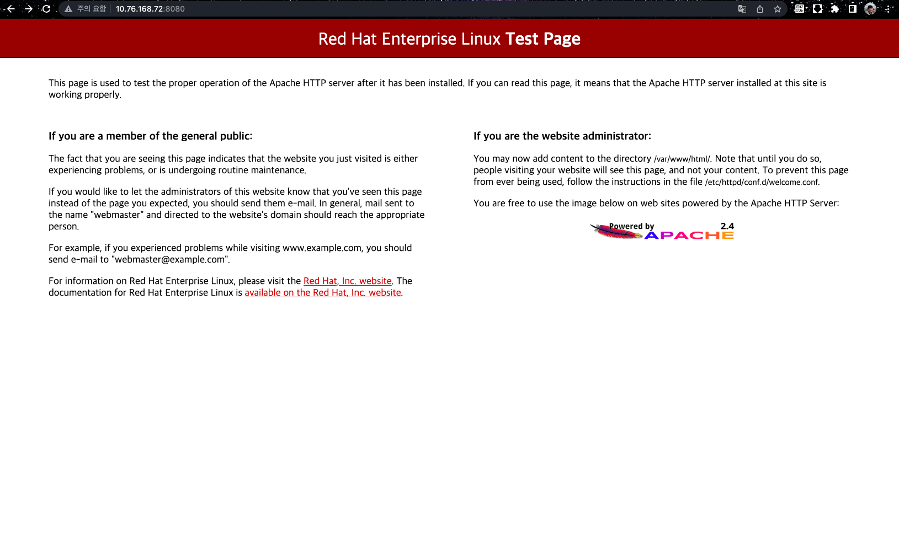
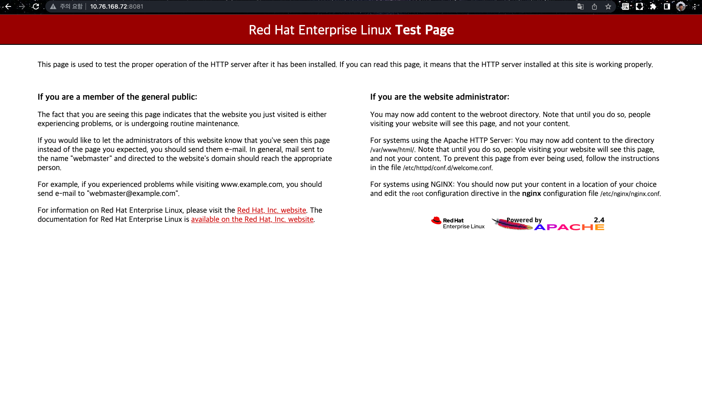
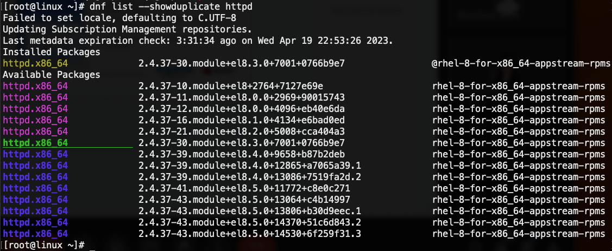
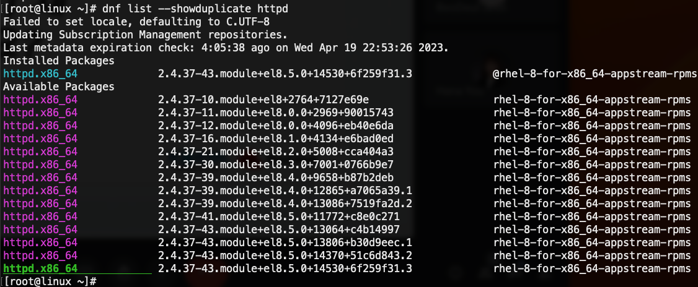
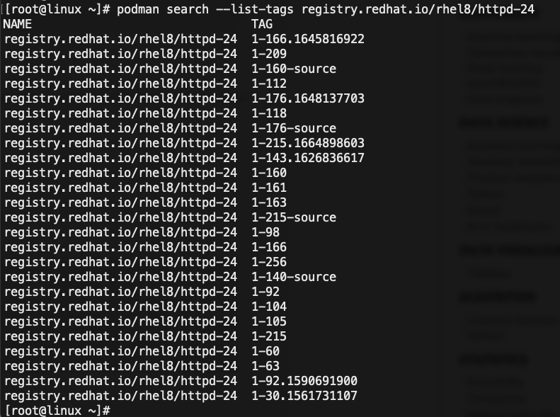

## Account Day - Container Demo

컨테이너 기술의 특징을 확인하고, 가상머신과의 차이점을 알아보는 데모입니다. 

```
목차
1. Apache 웹 서버 (HTTPD) 설치
2. 어플리케이션 배포 
3. 웹서버 버전 업그레이드 
4. 웹서버 버전 롤백 
5. 신뢰 시스템 공유 (goldenimage vs FileSystem vs container)
```

<br/>

### 1. Apache 웹 서버 (HTTPD) 설치
---

Apache 웹 서버를 RHEL OS와 컨테이너에 각각 구성해보면서 각각의 특징 및 차이점을 확인합니다.


**1-1) 가상머신 기반 리눅스에 httpd 설치**

Red Hat Enterprise Linux 8 운영체제에서 패키지 관리자 도구인 dnf를 통해 설치 가능한 httpd 버전을 확인합니다.
```bash
$ dnf list --showduplicate httpd
```

Red Hat Enterprise Linux 8 운영체제에서 패키지 관리자 도구인 dnf를 통해 httpd 서비스를 설치합니다.

```bash
$ dnf install -y httpd-2.4.37-47.module+el8.6.0+14529+083145da.1.x86_64
```

Apache 웹 서버인 httpd 데몬의 서비스 포트를 8080으로 변경합니다.

```bash
$ sed -i 's/Listen 80/Listen 8080/g' /etc/httpd/conf/httpd.conf
```

Apache 웹 서버인 httpd 서비스를 활성화하고 기동합니다. 

```bash
$ systemctl enable httpd
$ systemctl start httpd
```

웹 페이지를 호출하여 서비스 상태를 확인합니다.




**1-2) httpd 컨테이너를 사용하여 기동**


Red Hat에서 제공하는 검증된 httpd 이미지를 다운로드 받습니다. 
podman pull 명령어로 다운로드를 진행합니다.

```bash
$ podman pull registry.redhat.io/rhel8/httpd-24:1-160
$ podman images
```

다운로드 받은 httpd 이미지를 실행하여 웹 서버 서비스를 확인합니다.

```bash
$ podman run -d --name httpd -p 8081:8080 registry.redhat.io/rhel8/httpd-24:1-160
$ podman ps
```

웹 페이지를 호출하여 서비스 상태를 확인합니다.




**1-3) 요약 - 웹 서버 설치시 특징**

일반적인 가상머신의 OS 환경과 컨테이너 환경에서 웹 서버 구성의 시간 차이는 별로 나지 않았습니다.  

  
<br/>

### 2. 애플리케이션 배포
---

간단한 웹 페이지 기반의 게임 애플리케이션을 웹서버에 배포하여 서비스를 확인합니다. 
Git 소스에 있는 개발 소스를 로컬에 다운로드 합니다.

```bash
$ git clone https://github.com/ellisonleao/clumsy-bird/
$ ls ./clumsy-bird/
```

**2-1) 가상머신 기반 리눅스의 httpd 웹 서버에 APP 배포**

다운로드 받은 게임 소스를 웹 서버가 바라보는 애플리케이션 디렉터리 위치로 복사합니다.

```bash
# 애플리케이션 소스 위치 확인
$ cat /etc/httpd/conf/httpd.conf | grep DocumentRoot

# 기존 소스 백업
$ tar cvf app_old.tar /var/www/html

# 애플리케이션 소스 복사 
$ ls ./clumsy-bird/
$ cp -R ./clumsy-bird/* /var/www/html/
$ ls /var/www/html
```

*Apache 웹 서버의 DocumentRoot 설정 확인*


*애플리케이션 복사*


애플리케이션 복사가 완료되었으면, 웹 브라우저에서 게임 서비스를 확인합니다.


**2-2) httpd 컨테이너에 APP 배포**

기존에 서비스하던 httpd 컨테이너를 중지합니다. 

```bash
$ podman stop httpd
```

registry.redhat.io/rhel8/httpd-24:1-160 컨테이너에 개발 소스를 배포하는 Containerfile을 생성합니다.

```bash
$ cat <<EOF > Containerfile
FROM registry.redhat.io/rhel8/httpd-24:1-160

# Add application sources
RUN rm -rf /var/www/html/*
ADD ./clumsy-bird/ /var/www/html/

# The run script uses standard ways to run the application
CMD run-httpd
EOF
```

Containerfile 명세 파일을 활용하여 컨테이너 이미지를 생성합니다.

```bash
$ podman build -t httpd-game:1-160 .
$ podman images
```

새롭게 만든 httpd-game 이미지를 활용하여 컨테이너를 기동합니다.

```bash
$ podman run -d --name httpd-game-1-160 -p 8081:8080 httpd-game:1-160
$ podman ps
```


웹 브라우저에서 게임 서비스를 확인합니다.


**2-3) 요약 - 웹 어플리케이션 배포시 특징**

VM 기반 리눅스의 웹 서버에 새로운 애플리케이션을 배포하는 경우에는 기존 소스의 백업이 필요하지만, 웹 서버 컨테이너를 활용하는 경우에는 podman 명령어 실행시 소스 위치만 잡아주면 되므로 더 간단합니다.

<br/>


### 3. 웹서버 버전 업그레이드
---

**3-1) 리눅스에 설치된 httpd 웹 서버 업그레이드**

httpd 버전을 확인합니다.  
현재 버전은 <span style="color: green">2.4.37-30.module+el8.3.0+7001+0766b9e7</span> 입니다.

```bash
$ dnf list --showduplicate httpd
```



더 최신 버전인 <span style="color: yellow">2.4.37-43.module+el8.5.0+14530+6f259f31.3</span> 으로 httpd 웹 서버를 업그레이드합니다.

```bash
$ dnf update -y httpd-2.4.37-43.module+el8.5.0+14530+6f259f31.3.x86_64
```

httpd 버전이 <span style="color: yellow">2.4.37-43.module+el8.5.0+14530+6f259f31.3</span> 으로 업그레이드된 것을 확인합니다.

```bash
$ dnf list --showduplicate httpd
```



웹 브라우저에서 8080 포트를 호출하여 서비스의 정상 유무를 확인합니다.


**3-2) httpd 컨테이너의 웹 서버 업그레이드**

Podman 명령어로 httpd 컨테이너 이미지의 최근 Tag를 확인합니다.

```bash
$ podman search --list-tags registry.redhat.io/rhel8/httpd-24
```



기본 베이스가 되는 httpd 컨테이너의 버전 (<span style="color: yellow">1-256</span>)을 확정하고 Containerfile을 수정합니다.


```bash
$ cat Containerfile
$ sed -i 's/1-160/1-256/g' ./Containerfile
$ cat Containerfile
```

Containerfile 명세 파일을 활용하여 컨테이너 이미지를 생성합니다.

```bash
$ podman build -t httpd-game:1-256 .
$ podman images
```

기존 실행 중인 httpd-game-1-160 컨테이너는 중지하고, 새로운 버전의 httpd-game:1-256 이미지를 활용하여 컨테이너를 기동합니다.


```bash
$ podman stop httpd-game-1-160
$ podman ps
$ podman run -d --name httpd-game-1-256 -p 8081:8080 httpd-game:1-256
$ podman ps
```


웹 브라우저에서 8081 포트로 게임 서비스를 확인합니다.


**3-3) 요약 - 웹 서버 업그레이드**

리눅스 환경에서는 


<br/>

### 4. 웹서버 버전 롤백
---

**4-1) 리눅스에 설치된 httpd 웹 서버 버전 롤백**

기존의 httpd 웹 서버 버전인 <span style="color: green">2.4.37-30.module+el8.3.0+7001+0766b9e7</span> 로 다시 롤백합니다.

```bash
$ dnf list --showduplicate httpd
$ dnf downgrade -y httpd-2.4.37-30.module+el8.3.0+7001+0766b9e7.x86_64
```
버전이 롤백된 것을 확인합니다.

```bash
$ dnf list --showduplicate httpd
```


**4-2) httpd 컨테이너의 웹 서버 버전 롤백**

신규 버전의 httpd-game2 컨테이너를 중지한 후, 기존 버전인 httpd-game 컨테이너를 실행합니다.

```bash
$ podman ps
$ podman stop httpd-game-1-256
$ podman start httpd-game-1-160
$ podman ps
```


<br/>

### 5. 신뢰 시스템 공유 (goldenimage vs FileSystem vs container) 
---


